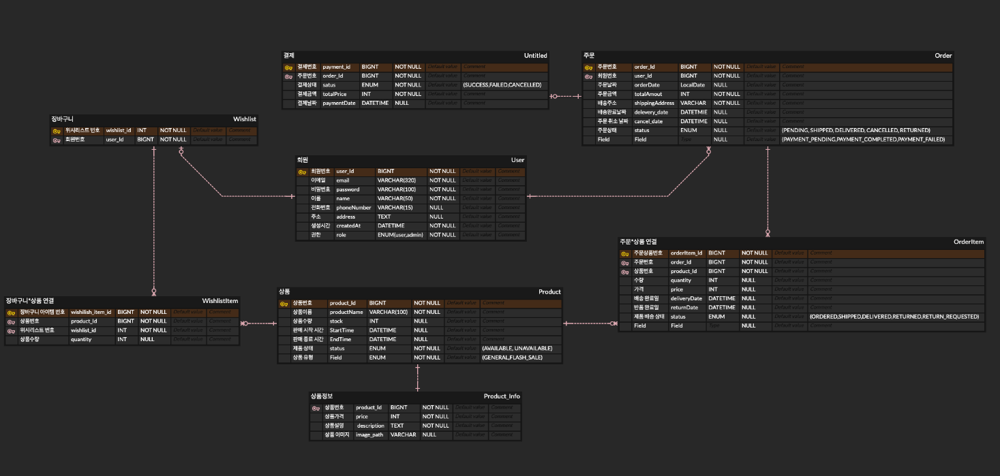

## 🕰 선착순 구매 프로젝트


### 프로젝트 설명

이 프로젝트는 선착순 구매 시스템을 안정적이고 효율적으로 구현하는 것을 목표로 합니다.
빠른 데이터 처리를 위해 Redis 캐싱을 활용하고, MSA 구조를 기반으로 유연한 서비스 설계를 적용하여 확장성과 신뢰성을 보장합니다.
이를 통해 다양한 상황에서도 일관된 성능을 제공하며 사용자 요구를 효과적으로 충족할 수 있도록 설계되었습니다.

--- 

## 📖 목차
1. [📅 프로젝트 기간](#프로젝트-기간)
2. [⚙️ 기술 스택](#기술-스택)
3. [🤖 주요 기능](#주요-기능)
4. [✏️ 기술적 고민 및 해결](#기술적-고민-및-해결)
5. [🐳 Docker 기반 실행 방법](#docker-기반-실행-방법)
6. [📄 프로젝트 문서 및 설계 자료](#프로젝트-문서-및-설계-자료)
7. [📖 프로젝트 Wiki](https://github.com/Choi-Hyeok99/haengye_project/wiki)


<h2 id="프로젝트-기간">📅 프로젝트 기간</h2>

- **프로젝트 시작일** : 2024.12.18
- **프로젝트 종료일** : 2024.01.15

---
<h2 id="기술-스택">⚙️ 기술 스택</h2>

| 분야          | 기술                | 아이콘 | 버전       |
| ----------- | ------------------ |-----|----------|
| **Backend** | Java              | ☕   | 17       |
|             | Spring Boot       | 🌱  | 3.x      |
|             | Spring Data JPA   | 📦  | -        |
|             | Spring Security   | 🛡  | -        |
| **Database** | MySQL             | 🐬  | 8.0.36   |
|             | Redis             | 🔥  | 7.4.1    |
| **Server**  | Docker            | 🐳  | 20.10.x  |
|             | Spring Cloud      | 📦  | 2024.0.0 |
| **Version Control** | Git               | 🛠  | -        |
|             | GitHub            | 🔗  | -        |
| **IDE**     | IntelliJ IDEA     | 💻  | Ultimate |
| **Test Tools**| K6                | 🧪  | 0.55.2   |
|             | Postman           | 📮  | -        |
| | JUnit 5           | 🧪  | -        |
| **Authentication** | JWT              | 🔑   | -        |

---

<h2 id="주요-기능">🤖 주요 기능</h2>

1. **선착순 구매 시스템**
    - **기능 설명**: 한정된 재고를 대상으로 일정 시간에 선착순으로 구매 가능한 시스템 구현
    - **특징**:
        - Redis 기반 캐싱과 분산 락을 활용해 높은 동시성 환경에서도 데이터 일관성 보장
        - K6 부하 테스트를 통해 1,000명 이상의 동시 요청을 안정적으로 처리

2. **MSA(Microservices Architecture)**
    - 도메인 중심의 MSA 구조 설계 및 서비스 간 독립성을 유지하여 확장성과 유지보수성을 극대화
    - **Feign Client**를 활용한 서비스 간 통신으로 모듈화 및 유연성 강화


3. **Spring Cloud (Eureka 서버 + API Gateway)**
    - Eureka를 활용한 동적 서비스 등록 및 API Gateway를 통한 인증, 요청 라우팅 및 필터링 처리로 MSA 통합 관리

4. **Docker Compose**
    - 각 서비스 컨테이너화를 통한 손쉬운 배포 및 테스트 환경 설정

5. **MySQL & Redis**
    - MySQL을 데이터 저장소로, Redis를 캐싱 및 분산 락 구현에 활용하여 데이터베이스 부하를 최소화

---

<h2 id="기술적-고민-및-해결">✏️ 기술적 고민 및 해결</h2>

1. **재고 감소 동시성 이슈 해결**
    - 초기: Pessimistic Lock으로 트랜잭션 충돌 방지
    - 이후: Redis 기반 분산 락을 도입해 성능 최적화 및 데이터 일관성 보장 

---
### 2. **회복 탄력성을 위한 Retry 도입**

- **문제**: 네트워크 불안정 또는 일시적 장애로 인해 재고 업데이트 요청이 실패하는 경우가 발생
- **해결**:
    - Redis 분산 락과 사용자 정의 Retry 로직을 활용하여 재시도 로직 구성
    - 재시도 횟수, 대기 간격, 최대 허용 시간 등을 설정하여 효율적으로 장애를 극복
    - Retry 적용으로 성공률이 향상되고 시스템의 안정성이 강화됨

---
- **문제**: K6 부하 테스트에서 다수의 동시 조회 시 성능 저하 발생
   - 동시 사용자가 증가할수록 TPS(초당 처리량)이 낮아지고 응답 시간이 증가함

- **해결**:
   - **데이터베이스 쿼리 인덱싱**: 자주 조회되는 필드에 인덱스를 추가하여 조회 속도를 최적화
   - **Redis 캐싱**: 자주 조회되는 데이터에 대해 Redis 캐시를 활용해 DB 부하를 줄임

### 개선 결과

| **동시 사용자 수** | **개선 전 (TPS)** | **개선 후 (TPS)** | **TPS 향상률(%)** |
|---------------------|-------------------|-------------------|-------------------|
| 100                 | 180               | 367               | 약 **104%**       |
| 500                 | 350               | 1,087             | 약 **211%**       |
| 1,000               | 367               | 1,307             | 약 **257%**       |

---

<h2 id="docker-기반-실행-방법">🐳 Docker 기반 실행 방법</h2>

1. Docker 설치 
 * [Docker 공식 홈페이지](https://www.docker.com/)에서 Docker Desktop 설치.


### 2. 프로젝트 클론

git clone https://github.com/Choi-Hyeok99/haengye_project.git

**Docker Compose 파일**
* 프로젝트 루트 디렉토리에 'docker-compose.yml'이 있어야 합니다
* 다음과 같이 작성해야합니다

<details>
<summary>docker-compose.yml 보기</summary>

```
version: '3.8'

services:
microservices_db:
image: mysql:8.0.36
container_name: microservices_db
ports:
- "3310:3306"
environment:
MYSQL_ROOT_PASSWORD: ${MYSQL_ROOT_PASSWORD}
MYSQL_DATABASE: ${MYSQL_DATABASE}
MYSQL_USER: ${MYSQL_USER}
MYSQL_PASSWORD: ${MYSQL_PASSWORD}
volumes:
- mysql_microservices_data:/var/lib/mysql
networks:
- my_network

redis:
image: redis:latest
container_name: haengye_redis
ports:
- "6379:6379"
volumes:
- redis_data:/data
healthcheck:
test: [ "CMD", "redis-cli", "ping" ]
interval: 10s
timeout: 5s
retries: 3
networks:
- my_network

# 나머지도 동일하게 추가 
```
</details>


<details>
<summary>docker 명령어</summary>

```
1. 컨테이너 실행
- 애플리케이션 및 MySQL 컨테이너를 실행합니다.
    docker-compose up --build

2.컨테이너 상태 확인
- 실행 중인 컨테이너를 확인합니다.
    docker ps

3. 컨테이너 로그 확인
- 특정 컨테이너의 로그를 확인합니다.
    docker logs <컨테이너 이름>

4. 컨테이너 정지 및 삭제 
- 실행 중인 컨테이너를 정지하고 삭제합니다.
    docker-compose down

5.Docker 이미지 및 컨테이너 정리
- 사용하지 않는 Docker 이미지 및 컨테이너를 정리합니다.
    docker system prune -a

```
</details>


---

<h2 id="프로젝트-문서-및-설계-자료">📄 프로젝트 문서 및 설계 자료</h2>


<details>
<summary>API 명세서</summary>

[API 명세서](https://documenter.getpostman.com/view/25757385/2sAYQZHsEV)
</details>

<details>
<summary>아키텍쳐</summary>


</details>

<details>
<summary>ERD</summary>


</details>

<details>
<summary>Sequence Diagram</summary>


</details>
