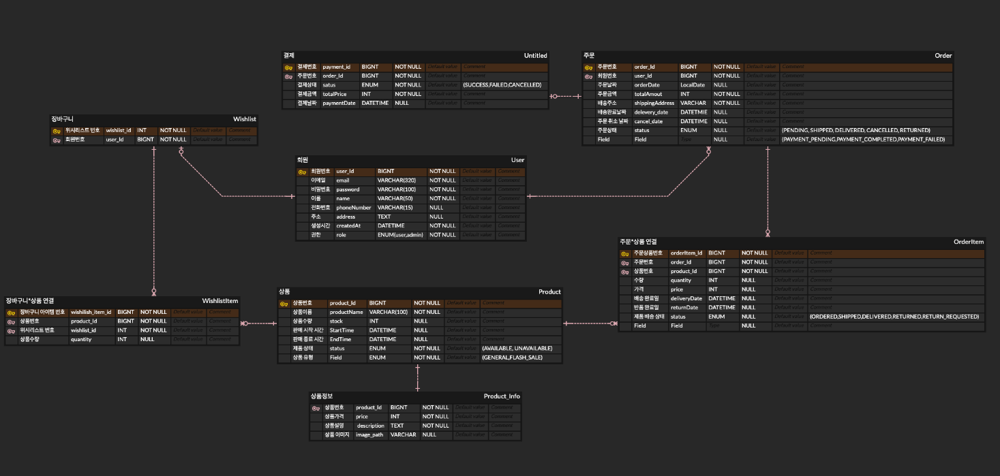

## 🕰 WiseBuy


### 프로젝트  설명

고물가 시대, 생활 필수품을 합리적인 가격에 구매하는 것이 점점 어려워지고 있습니다.
이 전자상거래 플랫폼은 단순한 상품 거래를 넘어, 한정된 재고를 선착순으로 구매할 수 있는 특별한 기능을 제공합니다.
경제적인 소비를 돕는 새로운 쇼핑 경험을 제공합니다.
한정 수량으로 제공되는 상품을 실시간으로 확인하고, 가장 합리적인 가격에 구매할 수 있는 기회를 놓치지 마세요!

--- 

> **최근 개선 (2026.09)** — 오래 묵혀둔 프로젝트를 다시 열어 아래 항목을 정리했습니다. 자세한 내용은 [최근 개선 로그](#최근-개선-로그).
> - 하드코딩돼 있던 JWT secret / 부하테스트 토큰 제거, Actuator 노출 범위 축소
> - `.env.example` 추가 + 누락 서비스(payment) 보강 + Kafka 리스너 정리 → `docker-compose up` 한 번으로 전체 스택 기동
> - 주석 처리돼 방치돼 있던 재고/동시성 로직 테스트 복원

--- 

## 📖 목차
1. [📅 프로젝트 기간](#프로젝트-기간)
2. [⚙️ 기술 스택](#기술-스택)
3. [🤖 주요 기능](#주요-기능)
4. [✏️ 기술적 고민 및 해결](#기술적-고민-및-해결)
5. [🐳 Docker 기반 실행 방법](#docker-기반-실행-방법)
6. [🔧 최근 개선 로그](#최근-개선-로그)
7. [📄 프로젝트 문서 및 설계 자료](#프로젝트-문서-및-설계-자료)
8. [📖 프로젝트 Wiki](https://github.com/Choi-Hyeok99/haengye_project/wiki)


## 📖 시스템 아키텍쳐


## 📖 Sequence Diagram


<h2 id="프로젝트-기간">📅 프로젝트 기간</h2>

- **프로젝트 시작일** : 2024.12.18
- **프로젝트 종료일** : 2025.01.15 ( MVP )
- **개인 프로젝트** (기획 · 설계 · 개발 전부 단독 진행)

---
<h2 id="기술-스택">⚙️ 기술 스택</h2>

| 분야          | 기술                | 아이콘 | 버전       |
| ----------- | ------------------ |-----|----------|
| **Backend** | Java              | ☕   | 17       |
|             | Spring Boot       | 🌱  | 3.x      |
|             | Spring Data JPA   | 📦  | -        |
|             | Spring Security   | 🛡  | -        |
| **Database** | MySQL             | 🐬  | 8.0.36   |
|             | Redis             | 🔥  | 7.x      |
| **Messaging** | Apache Kafka     | 📨  | 3.x      |
| **Resilience** | Resilience4j    | 🔁  | 2.1.0    |
| **Server**  | Docker            | 🐳  | 20.10.x  |
|             | Spring Cloud      | 📦  | 2024.0.0 |
| **Version Control** | Git               | 🛠  | -        |
|             | GitHub            | 🔗  | -        |
| **IDE**     | IntelliJ IDEA     | 💻  | Ultimate |
| **Test Tools**| K6                | 🧪  | 0.55.2   |
|             | Postman           | 📮  | -        |
| | JUnit 5           | 🧪  | -        |
| **Authentication** | JWT              | 🔑   | -        |

---

<h2 id="주요-기능">🤖 주요 기능</h2>

1. **선착순 구매 시스템 (핵심)**
    - **기능 설명**: 한정된 재고를 선착순으로 구매. 동시 주문이 몰려도 재고가 음수가 되지 않고(오버셀 방지), 재고 소진 시 정상 거절
    - **특징**:
        - 재고 차감을 Redis Lua 스크립트로 원자화 — "조회 → 부족 판정 → 차감"을 Redis 단일 스레드가 한 덩어리로 실행해 race condition 차단
        - Kafka로 DB 반영·결제 후처리를 비동기화, 실패 시 SAGA 보상 트랜잭션으로 재고 복구
        - k6 부하테스트로 처리량 한계와 병목을 측정 ([`load-test/`](load-test/), 수치는 아래 개선 결과 참고)

2. **MSA(Microservices Architecture)**
    - 도메인 중심의 MSA 구조 설계 및 서비스 간 독립성을 유지하여 확장성과 유지보수성을 극대화
    - **Feign Client**를 활용한 서비스 간 통신으로 모듈화 및 유연성 강화


3. **Spring Cloud (Eureka 서버 + API Gateway)**
    - Eureka를 활용한 동적 서비스 등록 및 API Gateway를 통한 인증, 요청 라우팅 및 필터링 처리로 MSA 통합 관리

4. **Docker Compose**
    - 각 서비스 컨테이너화를 통한 손쉬운 배포 및 테스트 환경 설정

5. **MySQL & Redis**
    - MySQL을 데이터 저장소로, Redis를 캐싱 및 분산 락 구현에 활용하여 데이터베이스 부하를 최소화

---

<h2 id="기술적-고민-및-해결">✏️ 기술적 고민 및 해결</h2>

1. **재고 감소 동시성 이슈 해결**
    - 1차: Pessimistic Lock으로 트랜잭션 충돌 방지 → 처리량 한계
    - 2차: Redisson 분산 락(RLock) 도입 → 락으로 순서는 보장되지만 "재고 조회 → 감소 → 저장"이 하나의 원자적 연산이 아니라, 락 타이밍/네트워크 지연에 따라 잘못된 재고가 저장될 여지가 남음
    - 3차(현재): **Redis Lua 스크립트**로 "조회 → 부족 판정 → 차감"을 단일 원자 연산으로 실행. Race condition 원천 차단 + 네트워크 왕복 감소. 이 과정에서 실사용이 사라진 Redisson 의존성/설정 클래스는 제거함(2026.09 정리)

---
### 2. **회복 탄력성을 위한 Retry 도입**

- **문제**: 네트워크 불안정 또는 일시적 장애로 인해 재고 업데이트 요청이 실패하는 경우가 발생
- **해결**:
    - Redis 분산 락과 사용자 정의 Retry 로직을 활용하여 재시도 로직 구성
    - 재시도 횟수, 대기 간격, 최대 허용 시간 등을 설정하여 효율적으로 장애를 극복
    - Retry 적용으로 성공률이 향상되고 시스템의 안정성이 강화됨

---
- **문제**: 부하가 올라갈수록 조회 응답이 느려지고 초당 처리량(TPS)이 정체됨

- **해결**:
   - 자주 조회되는 필드 인덱싱
   - 재고 조회를 Redis 캐시 우선으로 전환해 DB 부하 감소
   - 재고 차감 자체는 Redis Lua 스크립트로 원자화 (조회·비교·차감을 한 덩어리로 실행)

### 개선 결과 (초기 측정, 2024)

| k6 목표 부하 (VU) | 개선 전 (TPS) | 개선 후 (TPS) | 향상률 |
|---|---|---|---|
| 100    | 180 | 367   | 약 104% |
| 500    | 350 | 1,087 | 약 211% |
| 1,000  | 367 | 1,307 | 약 257% |
| 10,000 | 370 | 3,247 | 약 900% |

> - **VU(가상 사용자)는 k6 부하 설정값이지 시스템이 동시에 처리한 요청 수가 아님.**
> - 측정: 로컬 단일 머신, 부하생성기(k6)와 앱이 같은 호스트. 절대 TPS는 이 환경 한정이므로 **개선 전/후 비율** 기준으로 볼 것.
> - **개선 전** = JPA 비관적 락, 조회 캐시 없음 / **개선 후** = Redis Lua 원자적 차감 + 조회 캐싱 + Kafka 비동기 DB 반영.
> - ⚠️ **2026.09 재측정 진행 중** — 서비스 직접 / 게이트웨이 경유를 나눠서 재측정하고, 병목 분석과 함께 이 표를 교체할 예정. 부하 스크립트는 [`load-test/`](load-test/).

---

<h2 id="docker-기반-실행-방법">🐳 Docker 기반 실행 방법</h2>

전체 스택(MySQL · Redis · Kafka · Eureka · Gateway · 6개 도메인 서비스)이 `docker-compose.yml` 하나로 뜬다.

```bash
# 1. 클론
git clone https://github.com/Choi-Hyeok99/haengye_project.git
cd haengye_project

# 2. 환경변수 준비 — .env.example을 복사한 뒤 값을 채운다 (JWT_SECRET, DB 비밀번호 등)
cp .env.example .env

# 3. 빌드 + 기동
docker-compose up --build

# 4. 확인 — Gateway가 8000번, Eureka 대시보드가 8761번
docker ps
```

- 각 서비스는 DB/Redis 컨테이너보다 먼저 떠서 접속에 실패할 수 있으나 `restart: on-failure`로 자동 재기동된다. 최초 기동은 전부 안정화될 때까지 1~2분 걸린다.
- 서비스별 스키마(`user_schema`, `product_schema` …)는 JDBC 접속 시 `createDatabaseIfNotExist=true`로 자동 생성된다.
- 정리: `docker-compose down` (볼륨까지: `docker-compose down -v`)

<details>
<summary>포트 매핑</summary>

| 대상 | 포트 |
| --- | --- |
| API Gateway | 8000 |
| Eureka | 8761 |
| user / product / wishlist / order / payment | 8081 / 8082 / 8083 / 8084 / 8085 |
| MySQL | 3310 → 3306 |
| Redis | 6379 |
| Kafka (호스트에서 접속 시) | 9092 |
</details>


---

<h2 id="최근-개선-로그">🔧 최근 개선 로그</h2>

### 2026.09 — 포트폴리오 재정비

1년 가까이 방치했던 프로젝트를 다시 열어, 배포 없이 로컬에서 `docker-compose up` 한 번으로 전체 스택이 뜨는 것을 목표로 정리했다.

**보안**
- 코드에 평문으로 박혀 있던 JWT secret(gateway / common)을 `${JWT_SECRET}` 환경변수로 분리하고 값을 재발급
- k6 부하테스트 스크립트에 하드코딩돼 있던 실제 JWT 토큰·이메일을 제거 (이후 스크립트는 `load-test/`로 재작성)
- product 서비스의 Actuator 노출 범위를 `*` → `health, info`로 축소

**실행 환경**
- `.env.example` 추가 — 필요한 환경변수 목록과 채우는 방법을 문서화
- `docker-compose.yml`의 환경변수 이름을 각 서비스 `application.yml`이 실제로 참조하는 이름과 일치시킴 (이전엔 이름이 어긋나 주입이 안 되고 있었음)
- `docker-compose.yml`에서 통째로 빠져 있던 payment 서비스 컨테이너 추가
- Kafka 리스너를 컨테이너 내부용(`kafka:29092`)과 호스트용(`localhost:9092`)으로 분리 — 단일 리스너로는 컨테이너 안의 서비스가 브로커에 다시 붙지 못하던 문제 해결
- 각 `application.yml`에 로컬 기본값(`${REDIS_HOST:localhost}` 등)을 넣어, 도커 없이 실행할 때도 동작하도록 함

**재고 처리 경로 정리 (부하테스트 중 발견한 문제 수정)**
- 주문 시 재고가 오히려 **증가**하던 버그 수정 — 주문 서비스가 음수 수량을 보내는데 product의 Lua는 `DECRBY`(양수=차감)라 부호가 반대였고, 재고 부족 체크도 무력화돼 있었음. "차감할 수량은 양수"로 규약 통일
- Kafka 재고 반영 경로 이원화 정리 — `order.create`(배치 컨슈머, 무동작 상태였음)와 `stock.update`(배치/단건 설정 불일치로 미동작) 두 갈래를, `order.create` 이벤트에 상품·수량을 실어 **배치 컨슈머 하나가 상품별로 합산해 DB에 반영**하도록 통합
- 역할 분리: **Redis(Lua) = 동기 예약(오버셀 방지 관문)**, **Kafka 배치 = DB 반영(쓰기 묶음)**

**테스트**
- 전체가 주석 처리된 채 방치돼 있던 `ProductServiceTest`를 현재 재고 처리 구조에 맞게 재작성 — 재고 예약 / DB 반영 / 음수 클램프 등 15개 케이스, 인프라 없이 도는 순수 단위 테스트

**정리**
- 실사용처가 없던 Redisson 의존성·설정 클래스 제거 (분산 락은 Redis `SET NX PX` + Lua로 대체돼 있었음)

---

<h2 id="프로젝트-문서-및-설계-자료">📄 프로젝트 문서 및 설계 자료</h2>


<details>
<summary>API 명세서</summary>

[API 명세서](https://documenter.getpostman.com/view/25757385/2sAYQZHsEV)
</details>

<details>
<summary>ERD</summary>


</details>

