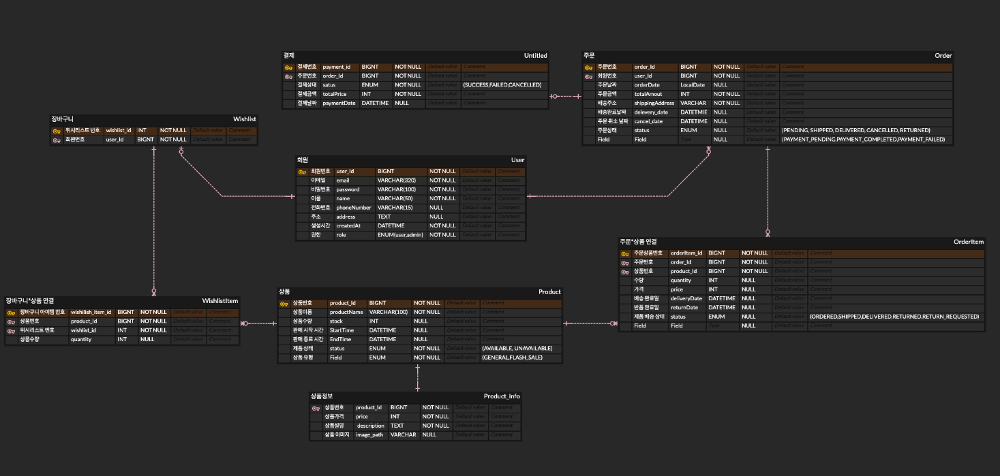

## 🕰 WiseBuy


### 프로젝트  설명

고물가 시대, 생활 필수품을 합리적인 가격에 구매하는 것이 점점 어려워지고 있습니다.
이 전자상거래 플랫폼은 단순한 상품 거래를 넘어, 한정된 재고를 선착순으로 구매할 수 있는 특별한 기능을 제공합니다.
경제적인 소비를 돕는 새로운 쇼핑 경험을 제공합니다.
한정 수량으로 제공되는 상품을 실시간으로 확인하고, 가장 합리적인 가격에 구매할 수 있는 기회를 놓치지 마세요!

--- 

> **최근 개선 (2026.09)** — 1년 가까이 묵혀둔 프로젝트를 다시 열어 정리했습니다. 자세한 내용은 [최근 개선 로그](#최근-개선-로그).
> - 보안 정리 (JWT secret / 부하테스트 토큰 하드코딩 제거, Actuator 축소)
> - `docker-compose up` 한 번으로 전체 스택 기동
> - 부하테스트로 병목을 다시 잡음: 재고 조회 게이트웨이 경유 p95 4초 → 35ms (원인은 요청당 DEBUG 로깅)
> - 재고 차감 버그(주문할수록 재고가 늘어남), 재고 부족인데 주문이 통과하던 버그 수정
> - Gateway Rate Limiter, order→product Circuit Breaker/TimeLimiter/Fallback 추가
> - Kafka 컨슈머 재시도/DLQ, 결제 실패 재고복구 멱등 처리 추가
> - 재고 조회 API 단독 성능 재측정: 100→2,000 RPS까지 올려가며 누적 50만 건, 오류 0%

--- 

## 📖 목차
1. [📅 프로젝트 기간](#프로젝트-기간)
2. [⚙️ 기술 스택](#기술-스택)
3. [🤖 주요 기능](#주요-기능)
4. [✏️ 기술적 고민 및 해결](#기술적-고민-및-해결)
5. [🐳 Docker 기반 실행 방법](#docker-기반-실행-방법)
6. [🔧 최근 개선 로그](#최근-개선-로그)
7. [📄 프로젝트 문서 및 설계 자료](#프로젝트-문서-및-설계-자료)
8. [📖 프로젝트 Wiki](https://github.com/Choi-Hyeok99/haengye_project/wiki)


## 📖 시스템 아키텍쳐


## 📖 Sequence Diagram


<h2 id="프로젝트-기간">📅 프로젝트 기간</h2>

- **프로젝트 시작일** : 2024.12.18
- **프로젝트 종료일** : 2025.01.15 ( MVP )
- **개인 프로젝트** (기획 · 설계 · 개발 전부 단독 진행)

---
<h2 id="기술-스택">⚙️ 기술 스택</h2>

| 분야          | 기술                | 아이콘 | 버전       |
| ----------- | ------------------ |-----|----------|
| **Backend** | Java              | ☕   | 17       |
|             | Spring Boot       | 🌱  | 3.x      |
|             | Spring Data JPA   | 📦  | -        |
|             | Spring Security   | 🛡  | -        |
| **Database** | MySQL             | 🐬  | 8.0.36   |
|             | Redis             | 🔥  | 7.x      |
| **Messaging** | Apache Kafka     | 📨  | 3.x      |
| **Resilience** | Resilience4j    | 🔁  | 2.1.0    |
| **Server**  | Docker            | 🐳  | 20.10.x  |
|             | Spring Cloud      | 📦  | 2024.0.0 |
| **Version Control** | Git               | 🛠  | -        |
|             | GitHub            | 🔗  | -        |
| **IDE**     | IntelliJ IDEA     | 💻  | Ultimate |
| **Test Tools**| K6                | 🧪  | 0.55.2   |
|             | Postman           | 📮  | -        |
| | JUnit 5           | 🧪  | -        |
| **Authentication** | JWT              | 🔑   | -        |

---

<h2 id="주요-기능">🤖 주요 기능</h2>

1. **선착순 구매 시스템 (핵심)**
    - **기능 설명**: 한정된 재고를 선착순으로 구매. 동시 주문이 몰려도 재고가 음수가 되지 않고(오버셀 방지), 재고 소진 시 정상 거절
    - **특징**:
        - 재고 차감을 Redis Lua 스크립트로 원자화 — "조회 → 부족 판정 → 차감"을 Redis 단일 스레드가 한 덩어리로 실행해 race condition 차단
        - Kafka로 DB 반영·결제 후처리를 비동기화, 실패 시 SAGA 보상 트랜잭션으로 재고 복구
        - k6 부하테스트로 처리량 한계와 병목을 측정 ([`load-test/`](load-test/), 수치·분석은 아래 [기술적 고민 및 해결](#기술적-고민-및-해결) 참고)

2. **MSA(Microservices Architecture)**
    - 도메인 중심의 MSA 구조 설계 및 서비스 간 독립성을 유지하여 확장성과 유지보수성을 극대화
    - **Feign Client**를 활용한 서비스 간 통신으로 모듈화 및 유연성 강화


3. **Spring Cloud (Eureka 서버 + API Gateway)**
    - Eureka를 활용한 동적 서비스 등록 및 API Gateway를 통한 인증, 요청 라우팅 및 필터링 처리로 MSA 통합 관리

4. **Docker Compose**
    - 각 서비스 컨테이너화를 통한 손쉬운 배포 및 테스트 환경 설정

5. **MySQL & Redis**
    - MySQL을 데이터 저장소로, Redis를 캐싱 및 Lua 스크립트 기반 원자적 재고 연산에 활용하여 데이터베이스 부하를 최소화
    - (별도 분산 락은 사용하지 않음 — Lua 스크립트 자체가 원자적이라 불필요하다고 판단해 2026.09에 제거)

6. **트래픽 보호 및 장애 격리**
    - Gateway에 Redis 기반 `RequestRateLimiter` 적용 — 사용자/IP별로 버킷을 나눠 route마다 다른 한도(재고 조회 100 req/s, 주문 20 req/s)를 두고, 넘으면 바로 429
    - order→product 호출에 Resilience4j `CircuitBreaker` + `TimeLimiter` + `Fallback` 적용 — product가 죽어도 빠르게 503으로 실패 처리
    - Kafka 컨슈머에 재시도(3회) + DLQ 적용 — 실패한 메시지가 조용히 사라지지 않고 `{topic}.DLT`로 남음

---

<h2 id="기술적-고민-및-해결">✏️ 기술적 고민 및 해결</h2>

### 1. 한정 재고 선착순 구매의 동시성 — 오버셀 방지

동시 주문이 한 상품에 몰릴 때 "재고 조회 → 부족 판정 → 차감"이 원자적이지 않으면 재고보다 많이 팔린다.

- 1차: Pessimistic Lock → 처리량 한계
- 2차: Redisson 분산 락(RLock) → 락으로 순서는 잡히지만 조회·차감·저장이 한 트랜잭션이 아니라 잘못된 재고가 저장될 여지가 남음
- 3차(현재): **Redis Lua 스크립트**로 3연산을 단일 원자 실행. Redis가 Lua를 단일 스레드로 통째 실행하므로 그 사이 다른 요청이 끼어들 수 없음. 네트워크 왕복도 1회.
- **검증**: 실제 Redis에 동시 800건 요청(재고 100) → 정확히 100건 성공 / 700건 거절 / 최종 재고 0, 음수 없음. ([`load-test/lua-concurrency-check.sh`](load-test/lua-concurrency-check.sh), JUnit 버전 `ProductStockConcurrencyTest`)
- 실사용이 사라진 Redisson 의존성·설정은 제거(2026.09).

이 과정에서 실제로 버그를 세 번 만났다. 하나는 주문 시 Redis에 음수 수량을 넘기고 있었는데 Lua 스크립트는 `DECRBY`(양수=차감) 기준이라 부호가 반대였던 것 — 주문할수록 재고가 오히려 늘어나는 버그였고, 부하테스트 후 재고가 100만에서 100만 1천으로 늘어나 있는 걸 보고 알아챘다. 또 하나는 재고 부족 예외가 재시도 로직에 걸려 있어서, 5번 재시도 후 fallback이 로그만 남기고 조용히 넘어가는 바람에 재고가 없어도 주문이 성공 처리되고 있었던 것. 마지막은 재고 반영 경로 두 개를 하나로 합치면서 DB 값으로 Redis 예약 카운터를 다시 덮어쓰는 코드를 새로 넣었는데, 이게 동시 주문 상황에서 오버셀로 이어질 수 있는 구조라 재검증하면서 찾아 제거했다.

### 2. 부하테스트로 병목을 단계적으로 특정 (2026.09 재수행)

"목표 부하를 찍고 성공"이 아니라 **RPS를 올려서 깨지는 지점과 그때 병목**을 측정하도록 스크립트를 다시 작성([`load-test/`](load-test/)). 409(재고 소진 정상 거절)는 실패에서 제외.

**(1) 재고 조회 API**

| 경로 | p95 | 비고 |
|---|---|---|
| API Gateway 경유 (`:8000`) — 개선 전 | **~4초** | 요청당 CPU 병목 |
| API Gateway 경유 — 개선 후 | **~35ms** | |

→ 게이트웨이가 요청 1건당 DEBUG 로그를 13줄 남기고 있었고(JWT 원문 포함), 부하 중엔 그 로깅이 라우팅보다 CPU를 더 먹었다. 로그를 `debug`로 내리고 JWT 로그를 제거하니 p95가 **약 100배** 개선.

**Product Service 순수 조회 성능 (2026.09.29, Gateway/Rate Limiter 배제, 직접 호출)**

인기 상품 1개(hot-key)에 조회가 집중되는 상황을 가정해, 목표 도착률을 100 → 2,000 RPS까지 8단계로 점진적으로 올리며 측정([`load-test/product-stock-progressive.js`](load-test/product-stock-progressive.js)).

| 목표 RPS | 실제 RPS | 요청 수 | avg | p95 | p99 | dropped | 오류율 |
|---|---:|---:|---:|---:|---:|---:|---:|
| 100 (warm-up) | 100.0 | 3,001 | 3.59ms | 5.80ms | 12.75ms | 0 | 0.00% |
| 300 | 300.0 | 18,001 | 1.89ms | 2.70ms | 5.90ms | 0 | 0.00% |
| 600 | 600.0 | 36,001 | 1.56ms | 2.01ms | 6.01ms | 0 | 0.00% |
| 900 | 900.0 | 54,001 | 1.99ms | 1.93ms | 14.74ms | 0 | 0.00% |
| 1,200 | 1,199.9 | 72,001 | 1.93ms | 3.56ms | 18.43ms | 0 | 0.00% |
| 1,500 | 1,499.9 | 90,001 | 2.82ms | 4.05ms | 38.02ms | 0 | 0.00% |
| 1,800 | 1,799.9 | 108,001 | 2.36ms | 3.38ms | 31.03ms | 0 | 0.00% |
| 2,000 | 1,999.9 | 120,000 | 3.33ms | 5.29ms | 70.89ms | 0 | 0.00% |

**누적 약 50만 건(501,007건)**, 7분 30초 동안 **dropped_iterations 0건·오류율 0%**를 유지했다 — 이 로컬 환경에서는 2,000 RPS까지 명확한 변곡점(성능이 꺾이는 지점)이 관찰되지 않았다. 2,000 RPS는 사전에 정한 확장 상한이라 그 이상은 검증하지 않았고, "2,000 RPS 이상도 처리 가능하다"는 의미는 아니다.

**(2) 주문 → 결제 플로우**

- 병목: order-service가 주문 1건에 동기 Feign 호출을 4~5회 하고 CPU가 포화. 그중 상품 조회는 `fetchWishlist`와 `processOrderItems`에서 **중복**이었음 → 상품당 1회로 정리.
- 현재(로컬 단일 머신, 부하생성기 동일 호스트): **약 246 req/s, p95 12초, 실패율 0.44%**. 부하 중에도 Redis 재고 = DB 재고 (정합성 유지).
- Kafka `order.create` 토픽을 파티션 3개로 늘려 재고 반영을 병렬화 — 단, 이번처럼 **한 상품에 트래픽이 몰리는 선착순 시나리오에선 이벤트 키(productId)가 같아 한 파티션으로만 감**. 여러 상품에 분산될 때 효과.

> 측정 환경: Docker Desktop 8GB/4vCPU, 컨테이너 11개 + k6가 같은 호스트. **절대 수치는 이 환경 한정.** 별도 인프라에서 부하생성 시 훨씬 높은 수치가 나옴.

### 3. 한계와 개선 방향

솔직하게, 아직 부족한 부분:

- **주문 플로우 p95 12초**는 "선착순"에 쓰기엔 느리다. order-service가 여전히 병목이고, 다음 단계는 동기 Feign 체인을 더 줄이거나 order-service를 다중 인스턴스로.
- 다중 상품 주문 중 일부 항목에서만 실패하는 경우(Redis 예약 성공 후 다음 항목에서 예외)에 대한 보상 로직은 아직 없다.
- Kafka 배치 리스너(order.create)는 실패 시 배치 전체가 재시도된다(레코드 단위 아님). 멱등 처리가 안전망 역할을 하지만 정밀 재시도는 아니다.
- 관측성(메트릭 대시보드·분산 트레이싱) 없음 — "병목이 어디인지"를 매번 `docker stats`로 확인하는 수준.
- 단일 인스턴스(Kafka·MySQL·각 서비스 1개). "대용량"이라 부르려면 수평 확장을 측정으로 보여야 함.
- 위 재고 조회 2,000 RPS 검증은 로컬 단일 머신(서버+k6 동시 실행) 기준이라 절대 성능으로 일반화할 수는 없다.

---

<h2 id="docker-기반-실행-방법">🐳 Docker 기반 실행 방법</h2>

전체 스택(MySQL · Redis · Kafka · Eureka · Gateway · 6개 도메인 서비스)이 `docker-compose.yml` 하나로 뜬다.

```bash
# 1. 클론
git clone https://github.com/Choi-Hyeok99/haengye_project.git
cd haengye_project

# 2. 환경변수 준비 — .env.example을 복사한 뒤 값을 채운다 (JWT_SECRET, DB 비밀번호 등)
cp .env.example .env

# 3. 빌드 + 기동
docker-compose up --build

# 4. 확인 — Gateway가 8000번, Eureka 대시보드가 8761번
docker ps
```

- 각 서비스는 DB/Redis 컨테이너보다 먼저 떠서 접속에 실패할 수 있으나 `restart: on-failure`로 자동 재기동된다. 최초 기동은 전부 안정화될 때까지 1~2분 걸린다.
- 서비스별 스키마(`user_schema`, `product_schema` …)는 JDBC 접속 시 `createDatabaseIfNotExist=true`로 자동 생성된다.
- 정리: `docker-compose down` (볼륨까지: `docker-compose down -v`)

<details>
<summary>포트 매핑</summary>

| 대상 | 포트 |
| --- | --- |
| API Gateway | 8000 |
| Eureka | 8761 |
| user / product / wishlist / order / payment | 8081 / 8082 / 8083 / 8084 / 8085 |
| MySQL | 3310 → 3306 |
| Redis | 6379 |
| Kafka (호스트에서 접속 시) | 9092 |
</details>


---

<h2 id="최근-개선-로그">🔧 최근 개선 로그</h2>

### 2026.09 — 포트폴리오 재정비

1년 가까이 방치했던 프로젝트를 다시 열어, 배포 없이 로컬에서 `docker-compose up` 한 번으로 전체 스택이 뜨는 것을 목표로 정리했다.

**보안**
- 코드에 평문으로 박혀 있던 JWT secret(gateway / common)을 `${JWT_SECRET}` 환경변수로 분리하고 값을 재발급
- k6 부하테스트 스크립트에 하드코딩돼 있던 실제 JWT 토큰·이메일을 제거 (이후 스크립트는 `load-test/`로 재작성)
- product 서비스의 Actuator 노출 범위를 `*` → `health, info`로 축소

**실행 환경**
- `.env.example` 추가 — 필요한 환경변수 목록과 채우는 방법을 문서화
- `docker-compose.yml`의 환경변수 이름을 각 서비스 `application.yml`이 실제로 참조하는 이름과 일치시킴 (이전엔 이름이 어긋나 주입이 안 되고 있었음)
- `docker-compose.yml`에서 통째로 빠져 있던 payment 서비스 컨테이너 추가
- Kafka 리스너를 컨테이너 내부용(`kafka:29092`)과 호스트용(`localhost:9092`)으로 분리 — 단일 리스너로는 컨테이너 안의 서비스가 브로커에 다시 붙지 못하던 문제 해결
- 각 `application.yml`에 로컬 기본값(`${REDIS_HOST:localhost}` 등)을 넣어, 도커 없이 실행할 때도 동작하도록 함

**재고 처리 경로 정리 (부하테스트 중 발견한 문제 수정)**
- 주문 시 재고가 오히려 **증가**하던 버그 수정 — 주문 서비스가 음수 수량을 보내는데 product의 Lua는 `DECRBY`(양수=차감)라 부호가 반대였음(부하테스트 후 재고 1,000,000 → 1,001,001로 실측 확인). "차감할 수량은 양수"로 규약 통일
- 재고 부족 예외가 재시도 로직에 걸려 있던 `@Retry`(retry-exceptions=IllegalStateException)에 5회 재시도된 뒤 fallback에서 로그만 남기고 삼켜져, 재고가 없어도 주문이 성공 처리되던 버그 수정. Lua 연산은 이미 원자적이라 재시도가 필요 없어 `@Retry` 자체를 제거
- Kafka 재고 반영 경로 이원화 정리 — `order.create`(배치 컨슈머, 무동작 상태였음)와 `stock.update`(배치/단건 설정 불일치로 미동작) 두 갈래를, `order.create` 이벤트에 상품·수량을 실어 **배치 컨슈머 하나가 상품별로 합산해 DB에 반영**하도록 통합
- 역할 분리: **Redis(Lua) = 동기 예약(오버셀 방지 관문)**, **Kafka 배치 = DB 반영(쓰기 묶음)**

**성능 (부하테스트 재수행 → 병목 특정 → 개선)**
- k6 스크립트를 "목표 부하 달성"이 아니라 "RPS를 올려 깨지는 지점 + 병목"을 보도록 재작성 ([`load-test/`](load-test/))
- 재고 조회: 게이트웨이 경유 시 p95가 4초였던 원인을 **요청당 DEBUG 로깅**으로 특정 → 제거 후 **p95 35ms (약 100배)**
- 주문 플로우: order-service의 중복 `getProductById` 호출 제거, DB 커넥션 풀 정상화(서비스별 100→20), Kafka `order.create` 파티션 3개
- 자세한 수치·한계는 [기술적 고민 및 해결](#기술적-고민-및-해결)

**테스트**
- 전체가 주석 처리된 채 방치돼 있던 `ProductServiceTest`를 현재 재고 처리 구조에 맞게 재작성 — 15개 케이스, 인프라 없이 도는 순수 단위 테스트
- 재고 동시성 테스트 추가 — 실제 Redis에 동시 800건 요청 → 오버셀 없음 검증

**정리**
- 실사용처가 없던 Redisson 의존성·설정 클래스 제거 (분산 락은 Redis `SET NX PX` + Lua로 대체돼 있었음)
- 전 서비스 Eureka `registry-fetch-interval` 600초 → 30초 (주석은 "5초마다"인데 값이 10분이라 로컬 재기동이 반영 안 됐음)

### 2026.09 (계속) — 회복탄력성 · 유입 제어

- Gateway에 Redis 토큰 버킷 기반 Rate Limiter 적용. 사용자/IP별로 버킷을 나누고 route마다 한도를 다르게 뒀다(재고 조회 100 req/s+버스트 200, 주문 20 req/s+버스트 40). 넘으면 바로 429
- order→product Feign 호출에 CircuitBreaker + TimeLimiter + Fallback 적용. product가 응답이 없으면 일정 시간 기다렸다가 빠르게 503으로 넘어가고, 실제 장애와 재고 소진(409)을 구분해서 처리
- 주문 API가 재고 부족(409)을 500으로 잘못 내보내던 매핑 문제 수정

### 2026.09.29 — Kafka 안정성 강화 · 대규모 성능 검증

- stock.rollback(결제 실패 시 재고 복구)에 멱등 처리를 추가했다. 같은 이벤트가 두 번 오면 재고도 두 번 복구되는 걸 확인해서, orderId를 payload에 싣고 "Redis 복구 완료"/"DB 반영 완료" 두 단계로 상태를 나눠 추적하도록 바꿨다. Redis는 끝났는데 DB만 실패한 경우에도 재시도 시 Redis는 다시 건드리지 않는다
- Kafka 컨슈머들이 예외를 잡고 로그만 남긴 채 넘어가서, 처리에 실패한 메시지도 "정상 처리"로 커밋되며 조용히 사라지고 있었다. 재시도 3회 후에도 실패하면 DLQ로 보내도록 고쳤다
- 재고 반영 경로 두 개를 하나로 합치는 과정에서, DB 값으로 Redis 캐시를 다시 써버리는 코드를 넣었었다. 이 키가 `reserveStock`이 관리하는 원자 카운터와 같은 키라 동시 주문 상황에서 오버셀로 이어질 수 있는 구조였고, 재검증하다 발견해서 그 쓰기 자체를 없앴다(캐시 미스 채움도 `SET`에서 `SET NX`로 바꿔 재발을 막음)
- 재고 조회 API 단독으로 Gateway/Rate Limiter 없이 100→2,000 RPS까지 올려가며 재측정. 7분 반 동안 누적 501,007건, 2,000 RPS 구간까지 실패 0건 (자세한 표는 [기술적 고민 및 해결](#기술적-고민-및-해결))

---

<h2 id="프로젝트-문서-및-설계-자료">📄 프로젝트 문서 및 설계 자료</h2>


<details>
<summary>API 명세서</summary>

[API 명세서](https://documenter.getpostman.com/view/25757385/2sAYQZHsEV)
</details>

<details>
<summary>ERD</summary>


</details>

